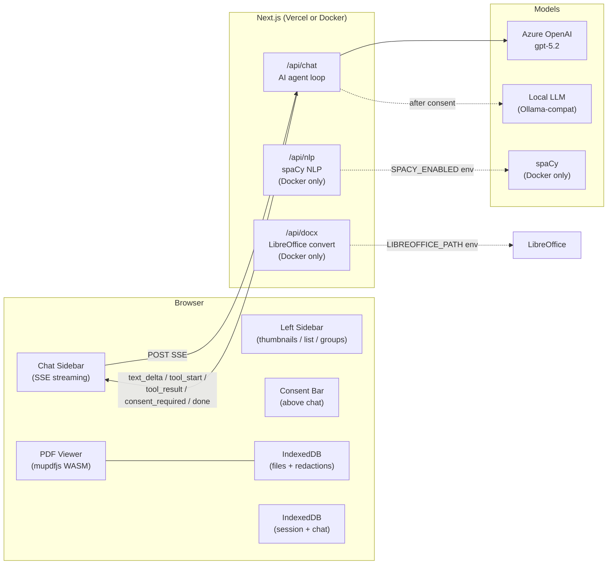

# EasyRedact — Agentic Document Redaction App

## Architecture




## Project Structure

```
easy-redact/
├── src/
│   ├── app/
│   │   ├── page.tsx               # Three-panel layout
│   │   ├── layout.tsx
│   │   └── api/
│   │       ├── chat/route.ts      # AI agent loop (SSE, from UN EOSG)
│   │       ├── docx/route.ts      # LibreOffice DOCX→PDF (Docker only)
│   │       └── nlp/route.ts       # spaCy NLP via Python script (Docker only)
│   ├── components/
│   │   ├── chat/                  # Copied + adapted from UN EOSG
│   │   │   ├── ChatPanel.tsx
│   │   │   ├── ChatMessage.tsx
│   │   │   ├── ChatInput.tsx
│   │   │   ├── ChatToolCall.tsx
│   │   │   └── useChatStream.ts
│   │   ├── pdf/                   # redaction-ui source copied verbatim then extended
│   │   │   ├── PdfRedactor.tsx
│   │   │   ├── PdfPage.tsx
│   │   │   ├── RedactionOverlay.tsx
│   │   │   ├── RedactionList.tsx
│   │   │   ├── useMupdf.ts        # copy exactly from redaction-ui
│   │   │   └── mupdf.worker.ts    # copy exactly from redaction-ui
│   │   ├── sidebar/
│   │   │   ├── LeftSidebar.tsx    # tabs: thumbnails / list / groups
│   │   │   ├── ThumbnailGrid.tsx
│   │   │   ├── RedactionChronological.tsx
│   │   │   └── RedactionGrouped.tsx
│   │   ├── ConsentBar.tsx         # data sharing selector above chat
│   │   └── ConsentModal.tsx       # modal triggered by consent_required SSE event
│   ├── lib/
│   │   ├── ai-client.ts           # cloud + local OpenAI clients, proxy support
│   │   ├── chat-tools.ts          # tool schemas + executors
│   │   ├── storage.ts             # IndexedDB only via `idb` (files + session + chat)
│   │   └── redaction-rules.ts     # fetch from GitHub raw URLs on demand
│   └── types/index.ts             # extended Redaction, Session types
├── scripts/
│   └── spacy_nlp.py               # uv inline script; stdin JSON → stdout JSON
├── Dockerfile                     # node:22-slim + LibreOffice + uv + spaCy model
├── docker-compose.yml
└── package.json
```

## Core Types

```typescript
// Extends redaction-ui's Redaction
type Redaction = {
  id: string; pageIndex: number; parts: RedactionPart[]
  rule?: RedactionRule
  status: 'manual' | 'suggested' | 'accepted' | 'ignored'
  confidence?: 'high' | 'low'
  person?: string       // "Max Mustermann"
  personGroup?: string  // "Bürger" | "Zivildienstleistende" | ...
  reason?: string
}

type Session = {
  id: string
  documents: { name: string; idbKey: string }[]
  redactions: Redaction[]
  chatMessages: Message[]
  consent: null | 'cloud' | 'local'
  modelSettings: { cloud: string; localBase: string; localModel: string }
  redactionMode: 'pii' | 'foi'
  foiJurisdiction?: string
}
```

## AI Agent Loop (`/api/chat/route.ts`)

Based on UN EOSG `route.ts`: up to 20 iterations, SSE events: `tool_start`, `tool_result`, `text_delta`, `consent_required`, `done`, `error`.

Model selection from request body `{ model: 'cloud' | 'local', consent }`. Cloud = Azure OpenAI gpt-5.2, Local = OpenAI-compat base URL (from `LOCAL_LLM_BASE_URL` env).

## `lib/ai-client.ts` — Client Setup + Proxy

Mirrors env var names from [redaction-app/backend/app/api.py](../redaction-app/backend/app/api.py) exactly: `AZURE_OPENAI_API_KEY`, `AZURE_OPENAI_API_BASE`, `AZURE_OPENAI_API_VERSION`, `OPENAI_API_BASE`, `OPENAI_API_KEY`, `LOCAL_LLM_MODEL`.

**Critical**: Node.js OpenAI SDK does not auto-detect `HTTPS_PROXY`/`HTTP_PROXY` env vars (unlike Python's httpx). Must explicitly wire up:

```typescript
import { HttpsProxyAgent } from 'https-proxy-agent'
const proxy = process.env.HTTPS_PROXY ?? process.env.HTTP_PROXY
const fetchOptions = proxy ? { agent: new HttpsProxyAgent(proxy) } : {}
const clientCloud = new AzureOpenAI({ ..., fetchOptions })
const clientLocal = new OpenAI({ baseURL: process.env.OPENAI_API_BASE, ..., fetchOptions })
```

## AI Tools (`lib/chat-tools.ts`)

- `ask_user(question, options[], allow_freeform)` — AI asks structured question; UI renders option chips + optional text input inline in chat
- `request_document_access(reason)` — triggers `consent_required` SSE event → `ConsentModal` outside chat; after user clicks, consent stored in session state; subsequent calls include `read_documents` in schema
- `read_documents()` — only registered in tool schema if `consent !== null`; returns structured text per page from mupdfjs text extraction (sent from client as part of request body after consent)
- `suggest_redactions(suggestions[])` — returns `RedactionSuggestion[]`; frontend maps `text` → coordinates via `searchPage()`; renders as `status: 'suggested'` redactions
- `start_nlp_processing(model)` — stub; returns processing started; triggers client-side spaCy call (not yet implemented)

**Document text flow**: text is extracted client-side by mupdfjs and included in the request body (not re-fetched by server), so the server never holds the raw PDF — only text that the user has explicitly consented to share.

## Consent Barrier

1. AI calls `request_document_access(reason: "I need to read the document to suggest redactions")`
2. API streams `{ type: "consent_required", reason }` + tool result `"Awaiting user decision"`, then `done`
3. `ConsentModal` appears (outside chat UI) with: [Share with Cloud AI ☁️] [Share with Local AI 🏠] [Don't share ✗] + explanatory text about Azure zero-retention, Cloud Act, etc.
4. User clicks → consent stored in `session.consent` (IndexedDB) → modal closes
5. Frontend auto-appends silent context entry to messages: `{ role: "tool", content: "User granted: cloud" }` (not rendered in chat)
6. Next user message or auto-resume sends the updated session with `read_documents` now in tool schema

## Storage — IndexedDB Only via `idb`

Single IndexedDB database with three object stores:

- `files`: `{ key: string, name: string, data: ArrayBuffer }` — PDF binary data
- `session`: `{ id: 'current', ...Session }` — single active session (v1)
- `chat`: `{ id: 'current', messages: Message[] }` — full chat history

No localStorage. The `idb` npm package provides a Promise-based wrapper. All reads/writes go through `lib/storage.ts`.

## mupdfjs Worker — Copy Verbatim

`src/components/pdf/useMupdf.ts` and `mupdf.worker.ts` must be **copied exactly** from `../redaction-ui/src/` — the Comlink worker setup, WASM loading path, and method signatures are already correct. Only additions needed: wire `next.config.ts` to handle the worker (`workerThreads: false`, `webpack` config for `.worker.ts` files) and copy the mupdf WASM assets to `public/`.

## Left Sidebar Tabs

- **Thumbnails**: mupdfjs renders each page as low-res PNG; badge overlay with `redactions.filter(r => r.pageIndex === i).length`
- **Chronological**: flat list sorted by `(pageIndex, y)`, shows text snippet, page, status chip, confidence badge
- **Grouped**: `personGroup` → `person` → redactions; bulk accept/ignore per person or group; counts

## Model & Mode Selection

- Prompted conversationally by AI via `ask_user` tool (not hardcoded forms)
- System prompt instructs AI to ask: redaction mode (PII/FOI), FOI jurisdiction if FOI, what categories of persons/info to redact, and which AI model the user is comfortable with
- AI must fully understand requirements before calling `request_document_access` or `suggest_redactions`

## Redaction Suggestion UX

- Rendered with dashed border + confidence color (high = amber, low = blue)
- Accept [✓] / Ignore [✗] buttons on hover in PDF + in sidebar list
- Accepted → solid black box + checkmark indicator
- Ignored → removed from view
- All accept/ignore actions silently appended to chat context (not rendered, but sent in next API call)

## DOCX Conversion + spaCy NLP (Docker-only)

`**/api/docx/route.ts`**: `multipart/form-data` → temp file → `spawn(LIBREOFFICE_PATH, ['--headless', '--convert-to', 'pdf', '--outdir', tmpDir, file])` → return PDF blob. Guarded by `process.env.LIBREOFFICE_PATH`. Returns HTTP 501 with clear message on Vercel.

`**/api/nlp/route.ts`**: accepts `{ pages: [{pageIndex, text}] }` JSON → `spawn('uv', ['run', 'scripts/spacy_nlp.py'])` → write JSON to stdin → read JSON from stdout → return `RedactionSuggestion[]`. Guarded by `process.env.SPACY_ENABLED`. Returns HTTP 501 on Vercel.

`**scripts/spacy_nlp.py`** (uv inline script):

```python
# /// script
# dependencies = ["spacy"]
# ///
import spacy, json, sys
nlp = spacy.load("de_core_news_lg")
pages = json.load(sys.stdin)
# ... map NER spans to RedactionSuggestion format, output to stdout
```

`**Dockerfile**` includes: `apt install libreoffice`, `pip install uv`, `uv run python -c "import spacy; spacy.cli.download('de_core_news_lg')"` (pre-downloads model at build time).

## Deployment

- **Vercel**: `next build` — full functionality except DOCX conversion
- **Docker**: `Dockerfile` = `node:22-slim` + `apt install libreoffice` + `COPY . .` + `next build` + `CMD next start`. `docker-compose.yml` for local dev.

## Redaction Rules — Fetched from GitHub on Demand

`lib/redaction-rules.ts` fetches from `https://raw.githubusercontent.com/datenlabor-bmz/redaction-rules/refs/heads/main/rules.json` to get the jurisdiction index, then fetches individual rule files by their `url` field (e.g. `https://raw.githubusercontent.com/datenlabor-bmz/redaction-rules/main/rules/de-ifg-bund.json`) when a jurisdiction is selected. Module-level cache so repeated accesses don't re-fetch. The AI receives the relevant jurisdiction's rules injected into its context when FOI mode is active.

## System Prompt (Major Deliverable)

The system prompt is the backbone of the agentic behavior. It must cover:

- **Role**: You are an AI redaction assistant for German government documents. You help users redact PDFs for PII and/or FOI release criteria.
- **Conversation flow**: Start by gathering requirements via `ask_user`. Do NOT make assumptions. Ask about: (1) redaction mode PII vs FOI, (2) if FOI: which jurisdiction, (3) which categories of persons to redact (private persons / civil servants / officials), (4) what types of data to redact (names, emails, phone numbers, amounts, etc.), (5) which AI model the user is comfortable using and why it's secure.
- **Privacy framing**: When asked about cloud AI, explain: Azure OpenAI offers GDPR compliance, ISO 27001/27018 certifications, zero data retention by default, and the US Cloud Act has never been applied to EU government customers.
- **Document access**: You do NOT have document access until the user explicitly grants it via the consent dialog. Direct users to click the consent button if you need document access. You can `request_document_access` to trigger that dialog.
- **Suggestion quality**: Ask clarifying questions until you have a clear picture. Minimize `confidence: 'low'` suggestions — use them only for genuinely ambiguous individual cases. Provide `person` and `personGroup` for every suggestion to enable grouped view.
- **User feedback loop**: User accept/ignore actions will appear in your context. Adapt subsequent suggestions based on patterns in what the user accepts or ignores.
- **Tool use discipline**: Use `ask_user` for structured choices, plain text for open discussion. Never suggest redactions without first understanding requirements.

## Env Vars

```
AZURE_OPENAI_API_KEY, AZURE_OPENAI_API_BASE, AZURE_OPENAI_API_VERSION
AZURE_OPENAI_DEPLOYMENT=gpt-5.2
OPENAI_API_BASE, OPENAI_API_KEY, LOCAL_LLM_MODEL  # local LLM
HTTPS_PROXY, HTTP_PROXY, NO_PROXY                  # corporate proxy passthrough
LIBREOFFICE_PATH=/usr/bin/libreoffice              # unset on Vercel
SPACY_ENABLED=true                                 # unset on Vercel
```

## Not Implemented in v1 (Stubs with UI Buttons)

- stanza / piiranha / custom NLP models
- In-browser HuggingFace NLP (see securedact for approach)
- Multi-session management

