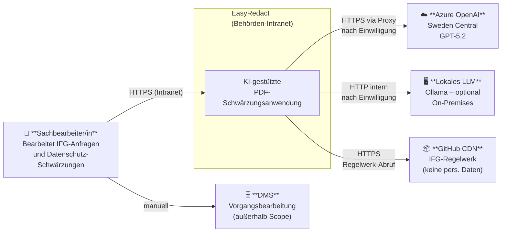
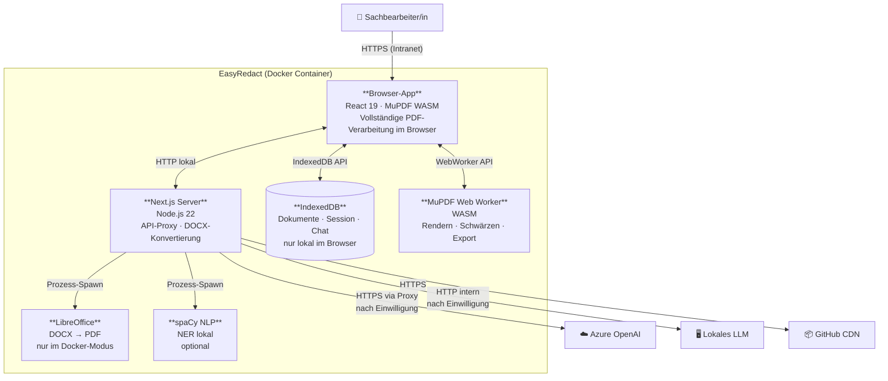
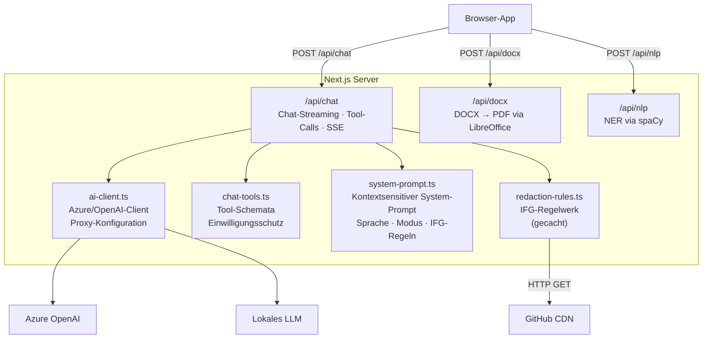
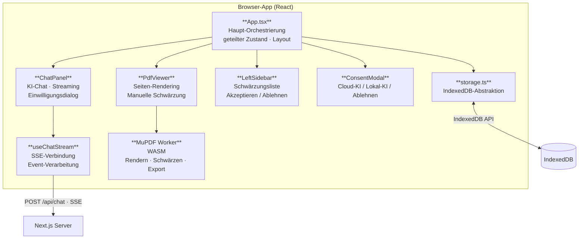
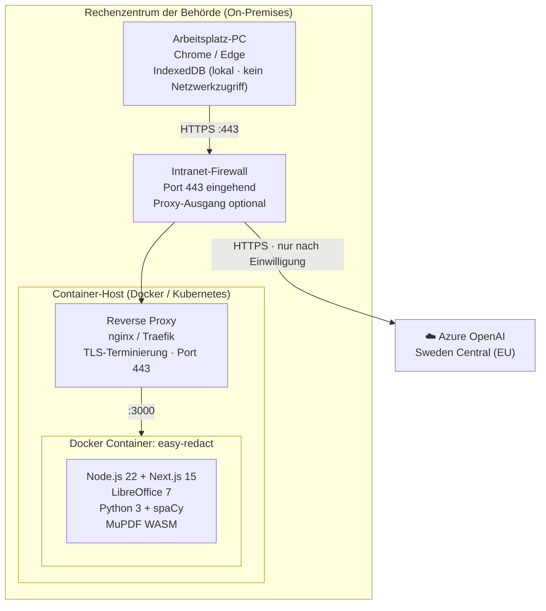
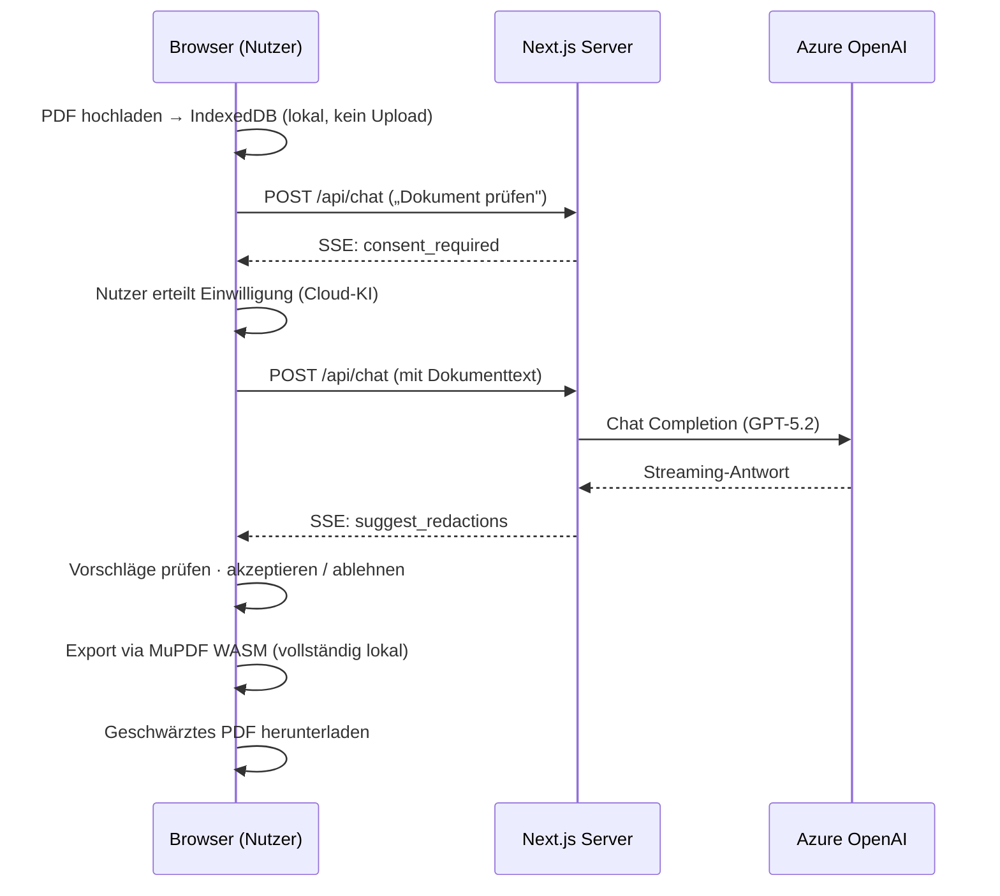

# C4-Architekturdiagramme – EasyRedact

**Dokumentversion:** 1.0  
**Stand:** Februar 2026  

Die Diagramme folgen dem C4-Modell nach Simon Brown (Level 1–3) sowie einem Deployment- und Sequenzdiagramm.

---

## Level 1 – Systemkontextdiagramm

Zeigt EasyRedact im Kontext der Nutzer und externen Systeme.

---

## Level 2 – Containerdiagramm

Zeigt die technischen Container innerhalb von EasyRedact.

---

## Level 3 – Komponentendiagramm: Next.js Server

Zeigt die internen Komponenten der API-Schicht.

---

## Level 3 – Komponentendiagramm: Browser-App

Zeigt die internen Komponenten der React-Client-Anwendung.

---

## Level 4 – Deployment-Diagramm (On-Premises)

---

## Datenfluss (Sequenzdiagramm)

