# C4-Architekturdiagramme – EasyRedact

**Dokumentversion:** 1.0  
**Stand:** Februar 2026  

Die Diagramme folgen dem C4-Modell nach Simon Brown (Level 1–3) sowie einem Deployment- und Sequenzdiagramm.

---

## Level 1 – Systemkontextdiagramm

Zeigt EasyRedact im Kontext der Nutzer und externen Systeme.

```mermaid
flowchart LR
    SB["👤 **Sachbearbeiter/in**\nBearbeitet IFG-Anfragen\nund Datenschutz-Schwärzungen"]

    subgraph ER["EasyRedact\n(Behörden-Intranet)"]
        APP["KI-gestützte\nPDF-Schwärzungsanwendung"]
    end

    AZ["☁️ **Azure OpenAI**\nSweden Central\nGPT-5.2"]
    LLM["🖥️ **Lokales LLM**\nOllama – optional\nOn-Premises"]
    GH["📦 **GitHub CDN**\nIFG-Regelwerk\n(keine pers. Daten)"]
    DMS["🗄️ **DMS**\nVorgangsbearbeitung\n(außerhalb Scope)"]

    SB -->|"HTTPS (Intranet)"| APP
    APP -->|"HTTPS via Proxy\nnach Einwilligung"| AZ
    APP -->|"HTTP intern\nnach Einwilligung"| LLM
    APP -->|"HTTPS\nRegelwerk-Abruf"| GH
    SB -->|"manuell"| DMS
```

---

## Level 2 – Containerdiagramm

Zeigt die technischen Container innerhalb von EasyRedact.

```mermaid
flowchart TD
    SB["👤 Sachbearbeiter/in"]
    AZ["☁️ Azure OpenAI"]
    LLM["🖥️ Lokales LLM"]
    GH["📦 GitHub CDN"]

    subgraph DOCKER["EasyRedact (Docker Container)"]
        NJS["**Next.js Server**\nNode.js 22\nAPI-Proxy · DOCX-Konvertierung"]
        APP["**Browser-App**\nReact 19 · MuPDF WASM\nVollständige PDF-Verarbeitung im Browser"]
        IDB[("**IndexedDB**\nDokumente · Session · Chat\nnur lokal im Browser")]
        WW["**MuPDF Web Worker**\nWASM\nRendern · Schwärzen · Export"]
        LO["**LibreOffice**\nDOCX → PDF\nnur im Docker-Modus"]
        NLP["**spaCy NLP**\nNER lokal\noptional"]
    end

    SB -->|"HTTPS (Intranet)"| APP
    APP <-->|"HTTP lokal"| NJS
    APP <-->|"WebWorker API"| WW
    APP <-->|"IndexedDB API"| IDB
    NJS -->|"HTTPS via Proxy\nnach Einwilligung"| AZ
    NJS -->|"HTTP intern\nnach Einwilligung"| LLM
    NJS -->|"Prozess-Spawn"| LO
    NJS -->|"Prozess-Spawn"| NLP
    NJS -->|"HTTPS"| GH
```

---

## Level 3 – Komponentendiagramm: Next.js Server

Zeigt die internen Komponenten der API-Schicht.

---

## Level 3 – Komponentendiagramm: Browser-App

Zeigt die internen Komponenten der React-Client-Anwendung.

```mermaid
flowchart TD
    NJS["Next.js Server"]
    IDB[("IndexedDB")]

    subgraph BROWSER["Browser-App (React)"]
        APP["**App.tsx**\nHaupt-Orchestrierung\ngeteilter Zustand · Layout"]
        PDF["**PdfViewer**\nSeiten-Rendering\nManuelle Schwärzung"]
        CHATP["**ChatPanel**\nKI-Chat · Streaming\nEinwilligungsdialog"]
        SIDE["**LeftSidebar**\nSchwärzungsliste\nAkzeptieren / Ablehnen"]
        CONSENT["**ConsentModal**\nCloud-KI / Lokal-KI / Ablehnen"]
        HOOK["**useChatStream**\nSSE-Verbindung\nEvent-Verarbeitung"]
        STORE["**storage.ts**\nIndexedDB-Abstraktion"]
        WORKER["**MuPDF Worker**\nWASM\nRendern · Schwärzen · Export"]
    end

    APP --> PDF
    APP --> CHATP
    APP --> SIDE
    APP --> CONSENT
    APP --> STORE
    CHATP --> HOOK
    HOOK -->|"POST /api/chat · SSE"| NJS
    PDF --> WORKER
    STORE <-->|"IndexedDB API"| IDB
```

---

## Level 4 – Deployment-Diagramm (On-Premises)

---

## Datenfluss (Sequenzdiagramm)

```mermaid
sequenceDiagram
    participant B as Browser (Nutzer)
    participant N as Next.js Server
    participant A as Azure OpenAI

    B->>B: PDF hochladen → IndexedDB (lokal, kein Upload)
    B->>N: POST /api/chat („Dokument prüfen")
    N-->>B: SSE: consent_required
    B->>B: Nutzer erteilt Einwilligung (Cloud-KI)
    B->>N: POST /api/chat (mit Dokumenttext)
    N->>A: Chat Completion (GPT-5.2)
    A-->>N: Streaming-Antwort
    N-->>B: SSE: suggest_redactions
    B->>B: Vorschläge prüfen · akzeptieren / ablehnen
    B->>B: Export via MuPDF WASM (vollständig lokal)
    B->>B: Geschwärztes PDF herunterladen
```

